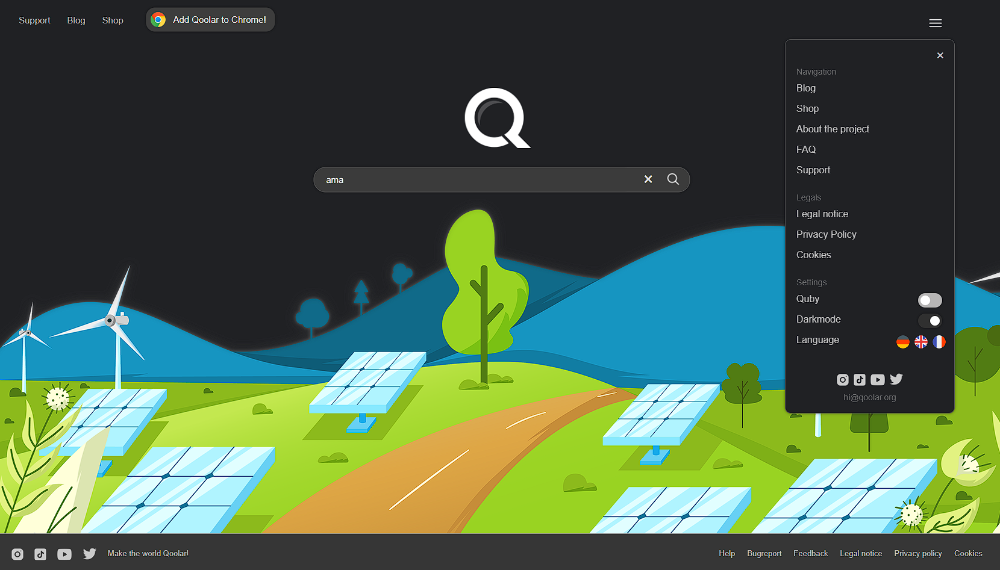
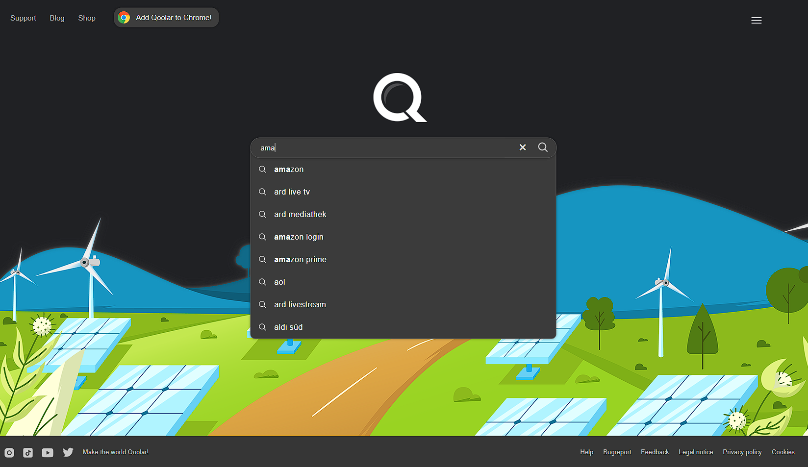
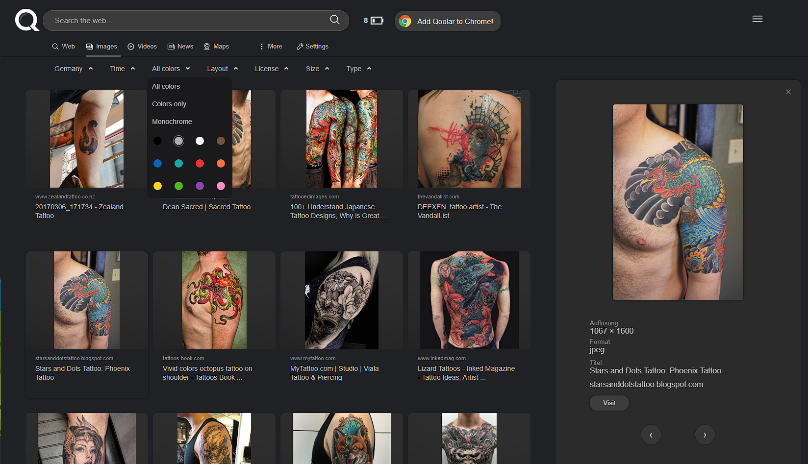

# Bing-API-Searchengine-PHP (last-modified)

## This search engine is an open-source project based on PHP and the Bing Search API. It is free to use and modify according to your needs. The codebase may require some adjustments and debugging to meet your specific requirements. We encourage contributions to improve its functionality and reliability.

Please be advised that the images included within the files are copyrighted and should not be used in a production environment.

It is recommended that you adapt this application to comply with the OWASP guidelines for secure coding practices to ensure a safe production environment. We do not assume any liability for the code, and it is your responsibility to fix any bugs and make necessary modifications. This software is provided for testing and conceptual purposes only.

## Enjoy!

